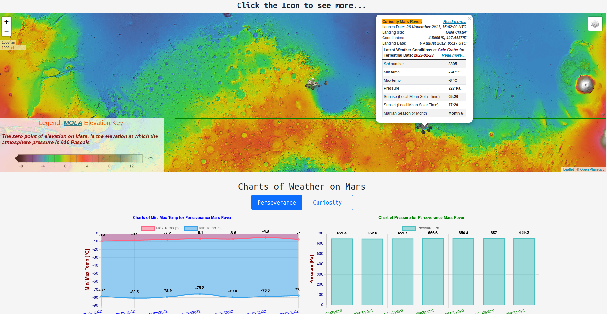

# MarsInfo_App

An application that provides a lot of information about Mars.

App demo: [https://marsinfoapp.web.app](https://marsinfoapp.web.app)

## Description

### The are five pages

At the end of the top navbar there is Credits&Info modal button. You can get the all the information about the app.

### The first page as **_Home_** is NASA's Astronomy Picture of the Day

You can see daily picture provided by [NASA APis](https://api.nasa.gov) by selecting a date or random date.

### The second page as **_Mars Weather_**

The are two maps. Each map has 3 layers you can choose.

1. Earth map with your location and your local weather conditions. When you click on the blue point on the first map you'll
   see a popup with another information such as exchange rates for your local currency and Covid situation in your country,
   your IP address and coordinates.

2. Mars map with Nasa's operational Mars lander and rovers locations (three devices as Feb, 2022). When you click on the
   icon, you will see information about the lander or rover.

3. At the bottom of the page is a graph showing Martian weather conditions over the past seven days.

All data about Mars are provided by [NASA APis](https://api.nasa.gov).

### The third page as **_Mars 3D_**

There is a 3D model of Mars generated by CesiumJS. You can choose one of two layers. On the Mars model there are three Nasa's
operational devices (as Feb, 2022). When you click on the icon you will see information about the lander or one of two
rovers.

### The fourth page as **_Mars Pictures_**

There is an accordion with two tabs. The first tab show pictures from Mars taken by Curiosity Mars Rover (operational). The
second one shows pictures taken by inactive rovers on Mars: Opportunity and Spirit. Pictures are provided by
[NASA APis](https://api.nasa.gov). You can watch the pictures in a lightbox.

### The fifth page as **_Nasa 3D Model_**

This is 3D animation showing Mars based on Three.js library and Nasa's **_3D .glb Model_** of Mars.

## Notes/ ToDo List/ Issues

1. The API keys for and some API https addresses are not hosted on the <GitHub.com>.
2. Responsiveness is not complete yet.

## ScreenShots

## Built With

- [TypeScript](https://www.typescriptlang.org) and [React](https://reactjs.org) are used to built the App.
- [Cesium](https://cesium.com) and [Resium](https://resium.reearth.io) are used to render the 3D model of Mars.
- [Leaflet](https://leafletjs.com) and [OpenLayers](https://openlayers.org) are used to render 2D maps of Earth and Mars.
- [Styled-Components](https://styled-components.com) and [Sass](https://sass-lang.com) are used to customize the UI.
- [Framer Motion](https://github.com/framer/motion) and [React-Spring](https://react-spring.io) are used to generate the
  animations.
- UI components are taken from: [React Bootstrap](https://react-bootstrap.github.io).
- Fetching data is done by using : [Axios](https://axios-http.com).
- Charts are rendered by: [Chart.js](https://www.chartjs.org).
- Client-side routing is done using: [React Router](https://v5.reactrouter.com).
- Table is generated using: [React Table](https://react-table.tanstack.com).
- Global state of the App is maintained by: [Redux](https://redux.js.org).
- Nasa's **_Mars 3D .glb Model_** is rendered using: [Three.js](https://threejs.org).
- Other libraries used to build the App: [GreenSock](https://greensock.com),
  [React-CountUp](https://react-countup.vercel.app), [React-Datepicker](https://reactdatepicker.com), and
  [Simple-React-Lightbox](https://github.com/michelecocuccio/simple-react-lightbox).

## APIs

- NASA Astronomy Picture of the Day, pictures taken by Mars Rovers and Mars Weather Conditions are taken from from:
  [NASA APIs](https://api.nasa.gov).
- Maps of Mars are provided by: [OpenPlanetary.org](https://www.openplanetary.org).
- World Imagery is provided by: [ArcGIS](https://services.arcgisonline.com/arcgis/rest/services/World_Imagery/MapServer).
- Local weather conditions are provided by: [OpenWeatherMap](https://openweathermap.org).
- Mars Imagery is provided by:
  [USGS - Astrogeology Science Center](https://www.usgs.gov/centers/astrogeology-science-center/maps).
- Covid Data is provided by: [mathdroid/covid-19-api](https://github.com/mathdroid/covid-19-api) (_temporarily unavailable_).
- Currency Exchange Rates are provided by: [ExchangeRate-API](https://www.exchangerate-api.com).
- IP Geolocation API is provided by: [IPWHOIS.IO](https://ipwhois.io).
- Earth maps are provided by: [Stamen Maps](https://maps.stamen.com) and [OpenStreetMap](https://www.openstreetmap.org).

## Other Staff/ Credits

- Package **_[@craco/craco](https://www.npmjs.com/package/@craco/craco)_** is used to override the standard
  [Create React App](https://create-react-app.dev/).
- Nasa **_Mars 3D .glb Model_** was taken from:
  [Nasa - Solar System Exploration](https://solarsystem.nasa.gov/resources/2372/mars-3d-model/).
- Those tutorial helped me to build the app:
  [APOD](https://medium.com/@jen.snyder/how-to-use-react-to-display-nasas-astronomy-picture-of-the-day-283c01ff9e31),
  [Animated Modal](https://www.geeksforgeeks.org/animated-modal-using-react-framer-motion-styled-components/),
  [Flying Text](https://dev.to/mandiwise/animate-the-opening-star-wars-crawl-with-react-hooks-and-greensock-3mk8),
  [Navbar](https://www.youtube.com/watch?v=D31P9ovJjqs) and
  [React-Spring](https://dev.to/vaibhavkhulbe/spring-it-on-a-complete-guide-to-react-spring-1om9).

## License

[MIT](https://choosealicense.com/licenses/mit)
